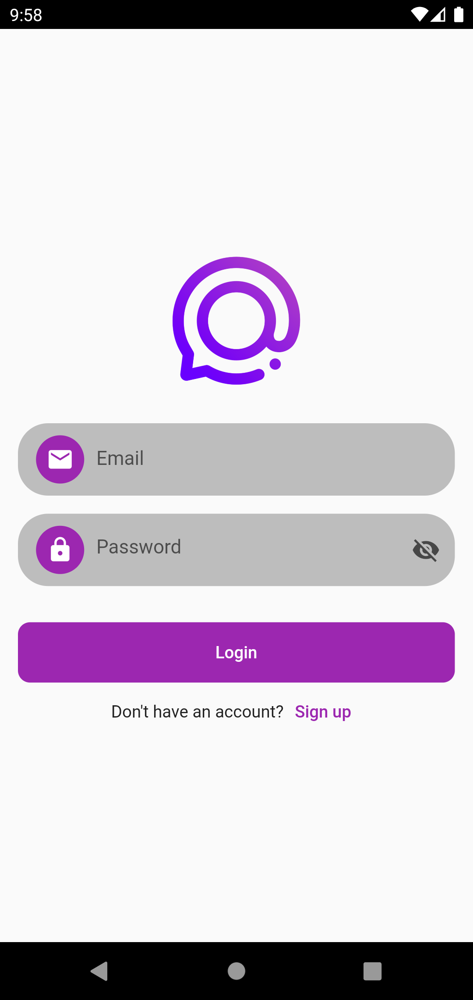
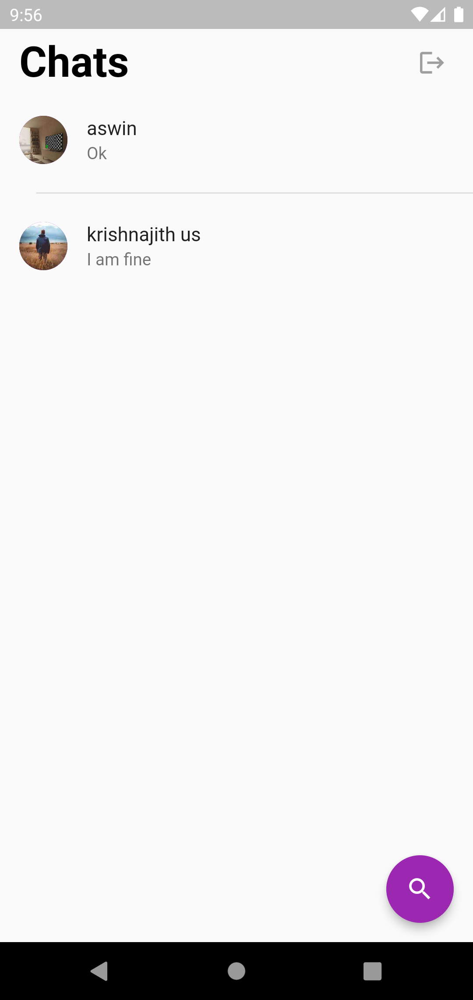
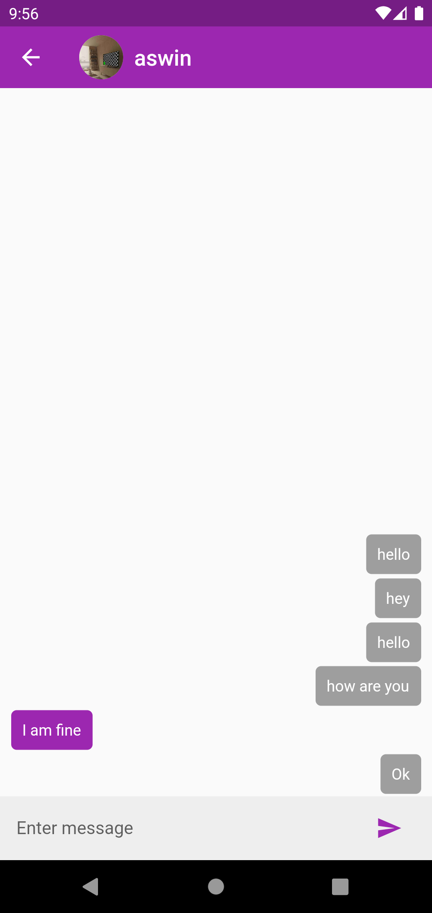

 # Chat New
 
  Chat new is a chat application build by using
  flutter and firebase.
  

## Table of contenst

- [Installation](#installation)
- [Usage](#usage)
- [Screenshots](#screenshots)
- [Packages and Credits](#packages-and-credits)
- [Google Play Store](#google-play-store)
- [License](#license)

## Installation

To install and run this project, you will need to have the following dependencies installed on
your machine:
 - Flutter SDK
 - Android Studio or Visual Studio Code

To install the project, follow these steps:

1. Clone the repository to your local machine
2. Open the project in Android Studio or Visual Studio Code
3. Connect an Android device or lauch an emulator
4. Run the command 'flutter pub get' using the terminal
5. Run the project by clicking the "run" button in the top menu or by using the terminal
   command 'flutter run'

## Usage 

User can do  the following:

- Create Account using email Id.
- Can find people by email Id.
- Can chat with other users.

## Screenshots 

Login Screen            |   Home Screen            |  Chat Room 
:-------------------------:|:-------------------------:|:-------------------------:|
|||

## Packages and Credits

- [Firebase auth](https://github.com/firebase/flutterfire/tree/master/packages/firebase_auth/firebase_auth)
- [Firebase core](https://github.com/firebase/flutterfire/tree/master/packages/firebase_core/firebase_core)
- [Firebase auth](https://github.com/firebase/flutterfire/tree/master/packages/firebase_auth/firebase_auth)
- [Firebase Storage](https://pub.dev/packages/firebase_storage)
- [Image Picker](https://pub.dev/packages/image_picker)
- [Uuid](https://github.com/Daegalus/dart-uuid)

## License

- MIT License
- Copyright 2022 © [Vivek V.G](https://github.com/Vivekvg01)